# 1. Создайте ВМ с Ubuntu 22.04/24.04 или подготовьте хост, на котором будет развёрнут Docker;

## 1. Подготовка среды виртуализации

На компьютере с Windows 11 Pro был включён компонент Hyper-V, необходимый для создания виртуальной машины. 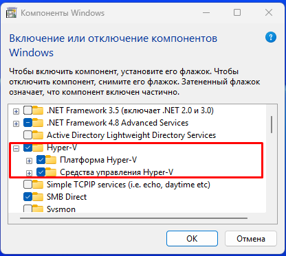

## 2. Загрузка образа операционной системы

С официального сайта Ubuntu (https://releases.ubuntu.com/24.04/) был загружен установочный ISO-образ Ubuntu 24.04 LTS - ubuntu-24.04.4-desktop-amd64.iso

## 3. Создание виртуальной машины

В среде Hyper-V была создана виртуальная машина

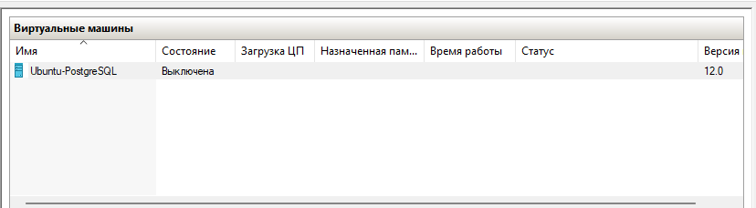

Параметры:

- имя: Ubuntu-PostgreSQL;
- поколение: 2;
- оперативная память: 4096 МБ;
- виртуальный диск: 40 ГБ;
- сетевое подключение: Default Switch;
- установочный образ: Ubuntu 24.04 LTS.

## 4. Установка Ubuntu

На созданную виртуальную машину была установлена операционная система Ubuntu 24.04.4 LTS.

Для проверки версии ОС была выполнена команда:

```bash
lsb_release -a
```
![]](images/03_ubuntu_installed.png)

```md
Дополнительно для удобства работы был установлен и настроен OpenSSH Server.
```

```bash
sudo apt install -y openssh-server
sudo systemctl enable ssh
sudo systemctl start ssh
```

# 2. Установите Docker Engine;

Для установки Docker Engine был использован официальный установочный скрипт Docker.

Перед установкой был обновлён список доступных пакетов:

```bash
sudo apt update
```

Сама установка:

```bash
curl -fsSL https://get.docker.com -o get-docker.sh && sudo sh get-docker.sh && rm get-docker.sh && sudo usermod -aG docker $USER && newgrp 
```

Проверили, что у нас все ок и докер установился:

```bash
docker --version
```

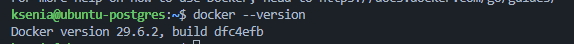

# 3. Создание каталога для хранения данных PostgreSQL

```bash
sudo mkdir -p /var/lib/postgresql
```

Проверка, что каталог успешно создан:

```bash
ls -ld /var/lib/postgresql
```

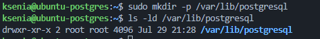

# 4. Разверните контейнер с PostgreSQL, смонтировав каталог хоста в каталог данных контейнера и пробросив порт 5432 для внешнего подключения;

Сначала была выполнена команда запуска контейнера:

```bash
docker run postgres:18
```

При выполнении команды возникла ошибка:

```text
permission denied while trying to connect to the Docker daemon socket at unix:///var/run/docker.sock
```

Ошибка возникла из-за того, что текущий пользователь не входил в группу `docker` и не имел прав на выполнение Docker-команд без `sudo`.

Для решения проблемы пользователь был добавлен в группу `docker`:

```bash
sudo usermod -aG docker $USER
```

После этого был выполнен повторный вход в систему. Наличие пользователя в группе `docker` было проверено командой:

```bash
groups
```

Далее был запущен с указанием пароля, пробросом порта `5432` и монтированием каталога хостовой системы:

```bash
docker run -d \
    --name postgres18 \
    -e POSTGRES_PASSWORD=123 \
    -p 5432:5432 \
    -v /var/lib/pg_docker:/var/lib/postgresql \
    postgres:18
```

После запуска состояние контейнера было проверено командой:

```bash
docker ps
```

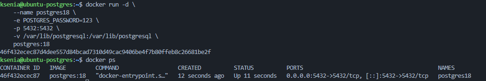

# 5. Разверните контейнер с клиентом PostgreSQL (psql);

Для подключения к серверу PostgreSQL был создан отдельный контейнер с клиентом `psql`.

Перед запуском контейнера была создана общая сеть Docker, чтобы контейнеры могли взаимодействовать друг с другом по имени:

```bash
docker network create pg-net
```

После этого контейнер с сервером PostgreSQL был запущен в созданной сети:

```bash
docker run -d --rm \
    --name postgres18 \
    --network pg-net \
    -e POSTGRES_PASSWORD=123 \
    -p 5432:5432 \
    -v /var/lib/pg_docker:/var/lib/postgresql/18/docker \
    postgres:18
```

Для проверки успешного запуска была выполнена команда:

```bash
docker ps
```

Далее был запущен отдельный контейнер с клиентом PostgreSQL (`psql`):

```bash
docker run -it --rm \
    --name pg-client \
    --network pg-net \
    postgres:18 \
    psql -h postgres18 -U postgres
```

После выполнения команды был запрошен пароль пользователя `postgres` и было установлено подключение к серверу PostgreSQL, о чём свидетельствует появление приглашения командной строки:

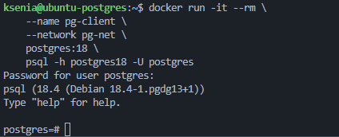


# 6. Подключитесь из контейнера с клиентом к контейнеру с сервером; создайте таблицу orders_test и добавьте минимум 2 строки;

Для создания таблицы была выполнена команда:

```sql
create table orders_test (
    id integer,
    product text
);
```

Добавлены две записи:

```sql
insert into orders_test values (1, 'Laptop');
insert into orders_test values (2, 'Mouse');
```

Для проверки содержимого таблицы был выполнен запрос:

```sql
select * from orders_test;
```

Результат:

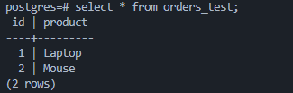

# 8. Подключитесь к PostgreSQL с ноутбука/рабочего компьютера извне хоста (по адресу хоста и порту 5432); выполните проверочный select из таблицы orders_test;

Первоначально была предпринята попытка подключения к серверу PostgreSQL с ноутбука по IP-адресу виртуальной машины 172.21.224.150, вышла ошибка:

```text
Connection attempt timed out.
```

Было установлено, что виртуальная машина Hyper-V использовала виртуальный коммутатор **Default Switch**, который работает в режиме NAT. В этом режиме виртуальная машина получает внутренний IP-адрес, доступный только компьютеру-хосту. Поэтому ноутбук, находящийся в той же локальной сети, не мог установить соединение с PostgreSQL.

Для обеспечения доступа к виртуальной машине извне была выполнена перенастройка сети Hyper-V.

Сначала был создан новый внешний виртуальный коммутатор (**External Virtual Switch**), привязанный к физическому сетевому адаптеру компьютера.

После создания виртуального коммутатора были открыты параметры виртуальной машины, где для сетевого адаптера вместо **Default Switch** был выбран созданный внешний виртуальный коммутатор.

После запуска виртуальной машины был выполнен контроль IP-адреса, виртуальная машина получила IP-адрес локальной сети:

```text
192.168.1.102
```

После этого подключение к серверу PostgreSQL выполнялось уже по новому адресу.

Соединение было успешно установлено:

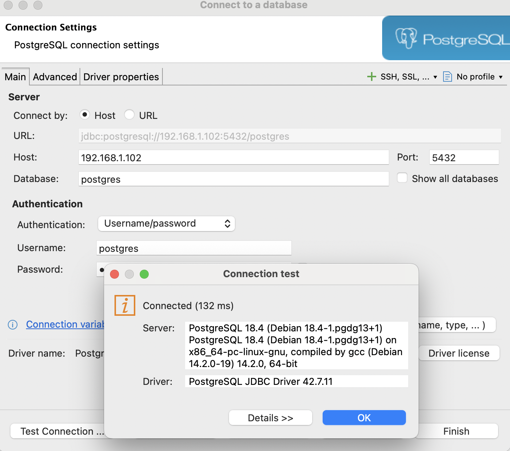

После подключения был выполнен проверочный SQL-запрос:

```sql
select * from orders_test;
```

В результате были получены ранее добавленные записи:

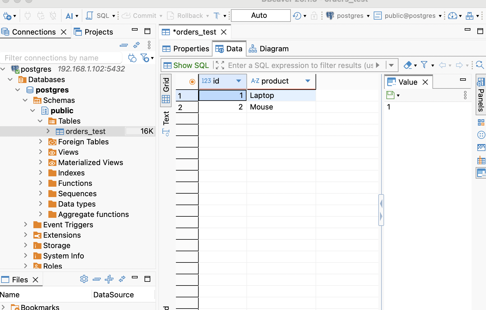

# 9. Остановите и удалите контейнер с сервером PostgreSQL;

Контейнер PostgreSQL был остановлен командой:

```bash
docker stop postgres18
```

Для проверки была выполнена команда:

```bash
docker ps -a
```

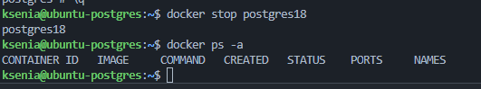

# 10. Создайте контейнер с сервером заново, используя тот же смонтированный каталог данных;

Контейнер был запущен командой:

```bash
docker run -d --rm \
    --name postgres18 \
    --network pg-net \
    -e POSTGRES_PASSWORD=123 \
    -p 5432:5432 \
    -v /var/lib/pg_docker:/var/lib/postgresql/18/docker \
    postgres:18
```

После запуска была выполнена проверка:

```bash
docker ps
```

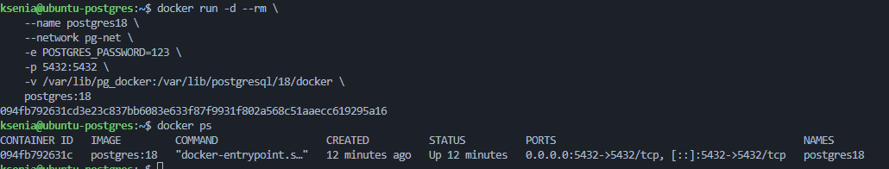

# 11. Подключитесь повторно из контейнера с клиентом и извне; проверьте, что строки в orders_test сохранились;

После повторного создания контейнера было выполнено подключение к PostgreSQL из контейнера-клиента:

```bash
docker run -it --rm \
    --name pg-client \
    --network pg-net \
    postgres:18 \
    psql -h postgres18 -U postgres
```

После подключения был выполнен запрос:

```sql
select * from orders_test;
```

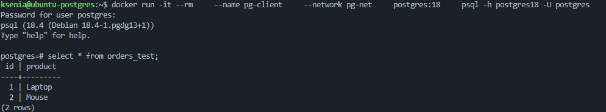

Еще раз проверка из DBeaver с ноутбука:

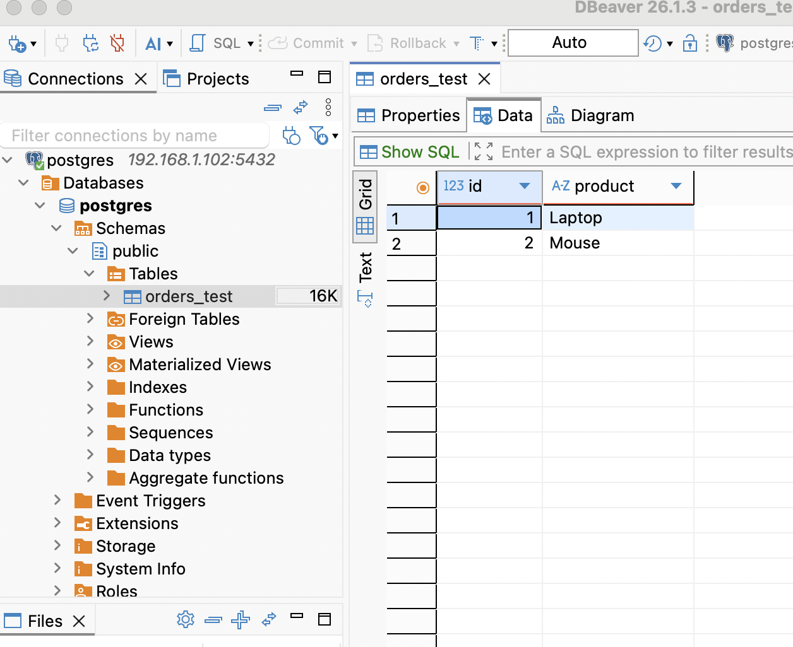