# 1. Создайте виртуальную машину с Ubuntu 22.04/24.04 LTS в ЯО/VirtualBox (или эквивалентный стенд с возможностью подключать диск);

Уже создана, проверяю версию
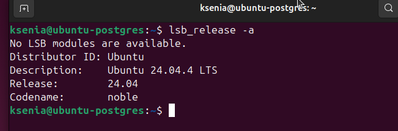

```bash
lsb_release -a
```

Подключаюсь со своего компьютера на Windows через ssh 
![(images/02_login2vm.png)

# 2. Установите PostgreSQL через apt;

Для установки PostgreSQL были обновлены списки пакетов и выполнена установка через менеджер пакетов `apt`:

```bash
sudo apt update
sudo apt install -y postgresql postgresql-contrib
```

После завершения установки PostgreSQL был успешно установлен.
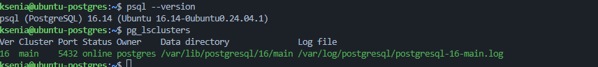

# 3. Проверьте, что кластер запущен (pg_lsclusters);

```text
pg_lsclusters
```


# 4. Под пользователем postgres подключитесь в psql, создайте таблицу test и добавьте 1–2 строки;

Под пользователем `postgres` было выполнено подключение к PostgreSQL:

```bash
sudo -i -u postgres
psql
```

После подключения была создана таблица `test` и добавлены две записи:

```sql
create table test (
    id integer,
    name varchar(50)
);

insert into test values
    (1, 'Laptop'),
    (2, 'Mouse');
```

Для проверки был выполнен запрос:

```sql
select * from test;
```

В результате были получены добавленные записи.

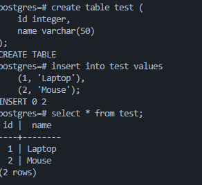

# 5. Остановите кластер PostgreSQL штатной командой (pg_ctlcluster ... stop);

Для остановки кластера PostgreSQL:

```bash
sudo pg_ctlcluster <версия> main stop
```

После остановки состояние кластера было проверено командой:

```bash
pg_lsclusters
```

В результате кластер перешел в состояние `down`.

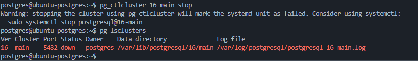


# 6. Создайте дополнительный диск 10 GB и подключите его к виртуальной машине;

В настройках виртуальной машины Hyper-V был создан и подключен дополнительный виртуальный диск объемом **10 GB**.

После запуска виртуальной машины наличие нового диска было проверено командой:

```bash
lsblk
```

В результате в системе появился новый диск объемом 10 GB.

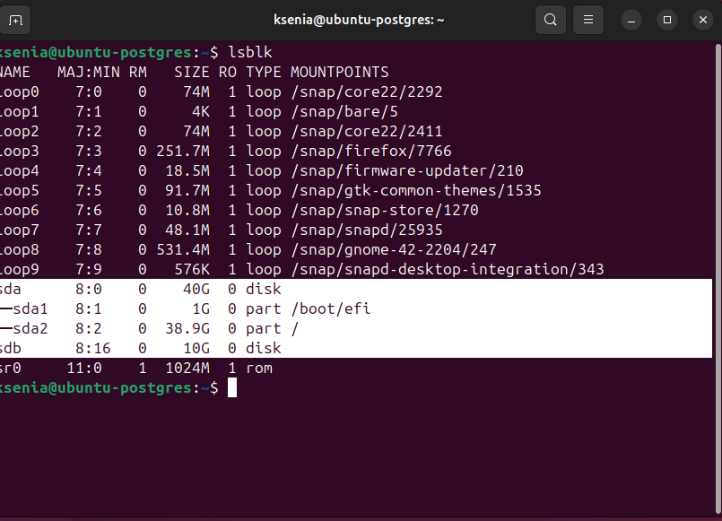

# 7. Разметьте диск, создайте файловую систему и примонтируйте, например, в /mnt/data;

Для нового диска был создан раздел с помощью `fdisk`:

```bash
sudo fdisk /dev/sdb
```

После этого была создана файловая система:

```bash
sudo mkfs.ext4 /dev/sdb1
```

При создании файловой системы возникла ошибка:

```text
/dev/sdb1 is apparently in use by the system; will not make a filesystem here!
```

Для устранения проблемы виртуальная машина была перезагружена, после чего команда создания файловой системы успешно выполнилась.

Затем была создана точка монтирования и выполнено монтирование раздела:

```bash
sudo mkdir -p /mnt/data
sudo mount /dev/sdb1 /mnt/data
```

Для проверки была выполнена команда:

```bash
lsblk -f
```

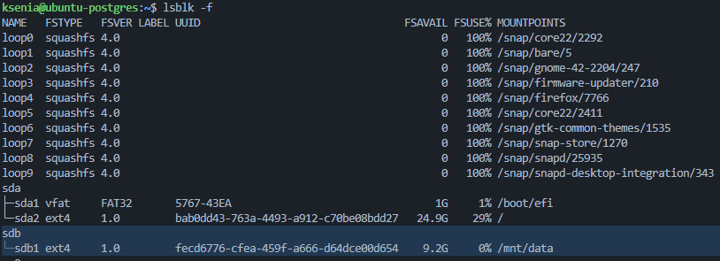

# 8. Настройте автомонтирование после перезагрузки (через fstab) и проверьте, что диск остаётся примонтированным;

Для настройки автоматического монтирования после перезагрузки был определен UUID раздела:

```bash
sudo blkid /dev/sdb1
```

Затем в файл `/etc/fstab` была добавлена строка:

```text
UUID=fecd6776-cfea-459f-a666-d64dce00d654  /mnt/data  ext4  defaults  0  2
```

После изменения конфигурации была выполнена проверка:

```bash
sudo mount -a
```

Ошибок обнаружено не было.

После перезагрузки виртуальной машины было выполнено:

```bash
lsblk -f
```

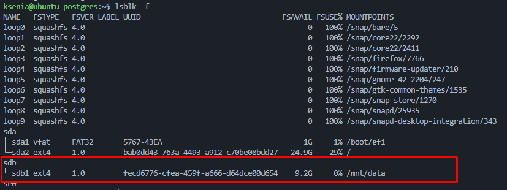

# 9. Назначьте владельцем каталога /mnt/data пользователя postgres;

Владельцем каталога `/mnt/data` был назначен пользователь `postgres`:

```bash
sudo chown postgres:postgres /mnt/data
```

Для проверки была выполнена команда:

```bash
ls -ld /mnt/data
```

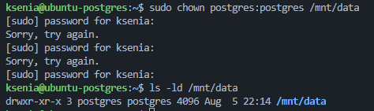

# 10. Перенесите каталог данных PostgreSQL с текущего пути на /mnt/data (с сохранением прав);

Текущий каталог данных PostgreSQL был скопирован на новый диск с сохранением прав доступа:

```bash
sudo rsync -av /var/lib/postgresql/<версия>/main /mnt/data/
```

Для проверки:

```bash
ls -l /mnt/data
```


# 11. Попробуйте запустить кластер; зафиксируйте результат и причину (если не стартовал);

Была выполнена попытка запуска кластера:

```bash
sudo pg_ctlcluster 16 main start
```

Статус кластера был проверен командой:

```bash
pg_lsclusters
```

Кластер успешно запустился. Но на данном этапе PostgreSQL продолжает использовать каталог данных:

```text
/var/lib/postgresql/16/main
```

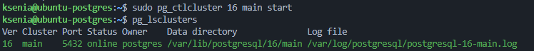

# 12. Найдите в конфигурации /etc/postgresql/<версия>/main параметр, который указывает на каталог данных, измените его на новый путь и объясните изменение; / 13. Запустите кластер повторно;

В файле конфигурации:

```text
/etc/postgresql/16/main/postgresql.conf
```

параметр:

```text
data_directory = '/var/lib/postgresql/16/main'
```

был изменён на:

```text
data_directory = '/mnt/data/main'
```

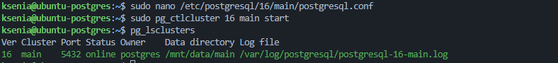

# 14. Подключитесь через psql и проверьте, что таблица test и данные сохранились;

Для проверки был выполнен вход в `psql`:

```bash
sudo -u postgres psql
```

Список таблиц был проверен командой:

```sql
\dt
```

После этого были получены данные из таблицы:

```sql
select * from test;
```

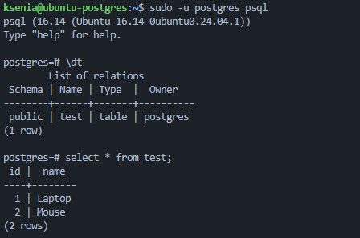