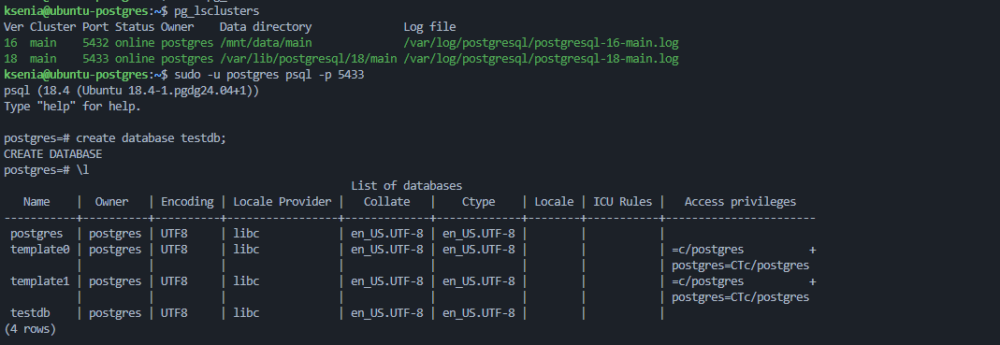
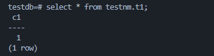
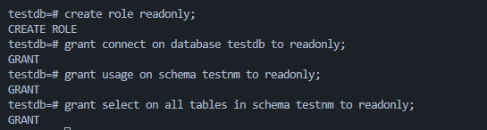
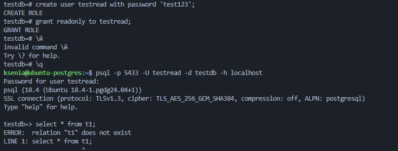
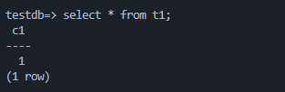
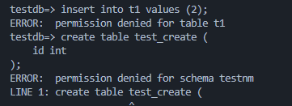

# 1. Создайте кластер PostgreSQL 17 и базу testdb;

Был создан и запущен кластер PostgreSQL 18:

```bash
sudo pg_createcluster 18 main
sudo pg_ctlcluster 18 main start
```

Состояние кластеров проверено командой:

```bash
pg_lsclusters
```

После подключения к кластеру PostgreSQL 18 была создана база данных:

```sql
create database testdb;
```

База `testdb` успешно создана.



# 2. Создайте схему testnm, таблицу t1(c1 int) и вставьте строку;

В базе `testdb` была создана схема `testnm`:

```sql
create schema testnm;
```

В схеме создана таблица `t1`:

```sql
create table testnm.t1 (
    c1 int
);
```

В таблицу добавлена строка:

```sql
insert into testnm.t1 values (1);
```

Для проверки выполнен запрос:

```sql
select * from testnm.t1;
```



# 3. Создайте роль readonly, выдайте ей CONNECT к testdb, USAGE на testnm, SELECT на таблицы схемы testnm;

Создана роль `readonly`:

```sql
create role readonly;
```

Роли выданы права на подключение к базе `testdb`:

```sql
grant connect on database testdb to readonly;
```

На использование схемы `testnm`:

```sql
grant usage on schema testnm to readonly;
```

И на чтение всех таблиц схемы `testnm`:

```sql
grant select on all tables in schema testnm to readonly;
```



# 4. Создайте пользователя testread/test123, назначьте роль readonly, выполните select * from t1; и зафиксируйте результат;

Создан пользователь `testread` с паролем `test123`:

```sql
create user testread with password 'test123';
```

Пользователю назначена роль `readonly`:

```sql
grant readonly to testread;
```

Выполнено подключение к базе `testdb` под пользователем `testread`:

```bash
psql -p 5433 -U testread -d testdb -h localhost
```

Выполнен запрос:

```sql
select * from t1;
```

Получена ошибка:

```text
ERROR: relation "t1" does not exist
```



# 5. Пересоздайте таблицу как testnm.t1, проверьте select * from testnm.t1; и настройте поведение, чтобы обращение к t1 было предсказуемым;

Таблица была пересоздана в схеме `testnm`:

```sql
drop table if exists testnm.t1;

create table testnm.t1 (
    c1 int
);

insert into testnm.t1 values (1);
```

Проверено обращение по полному имени:

```sql
select * from testnm.t1;
```

Для пользователя `testread` настроен `search_path`:

```sql
alter role testread in database testdb
set search_path = testnm, public;
```

После пересоздания таблицы потребовалось повторно выдать право `SELECT` роли `readonly`:

```sql
grant select on all tables in schema testnm to readonly;
```

После повторного подключения проверено обращение по короткому имени:

```sql
select * from t1;
```



# 6. Под testread проверьте попытку create table и insert; при необходимости запретите и подтвердите запрет повторной проверкой.

Под пользователем `testread` была выполнена попытка добавить данные:

```sql
insert into t1 values (2);
```

Операция была запрещена:

```text
ERROR: permission denied for table t1
```

Также была выполнена попытка создать новую таблицу:

```sql
create table test_create (
    id int
);
```

Создание таблицы также запрещено:

```text
ERROR: permission denied for schema testnm
```

