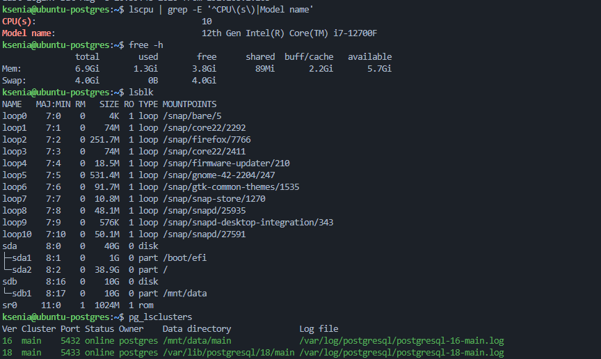
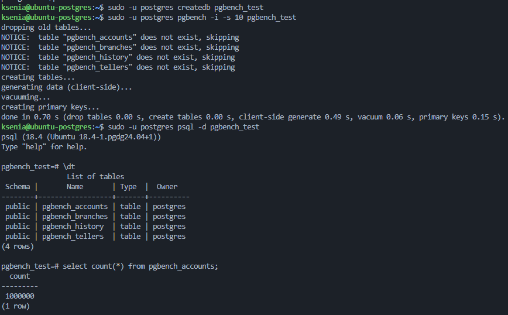
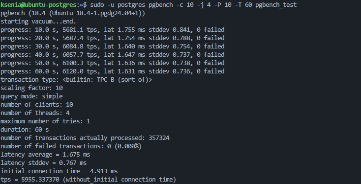
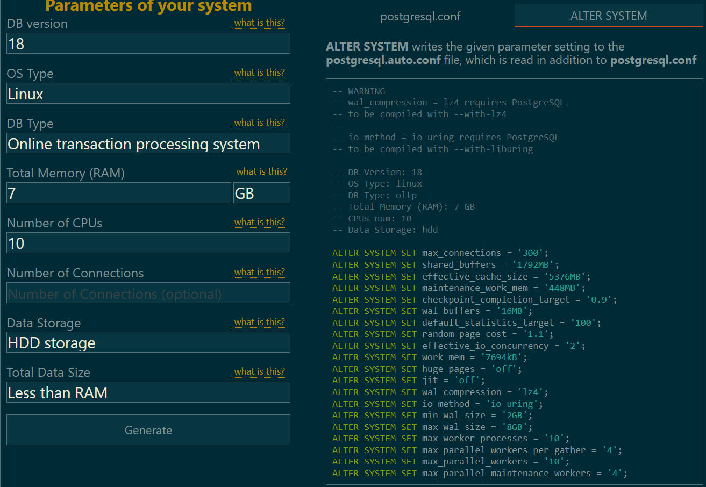
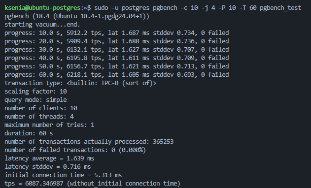
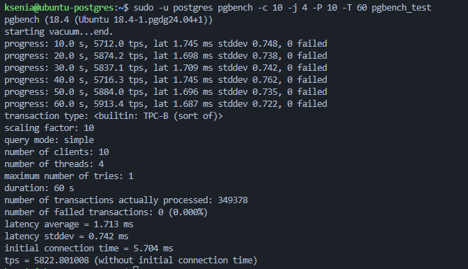
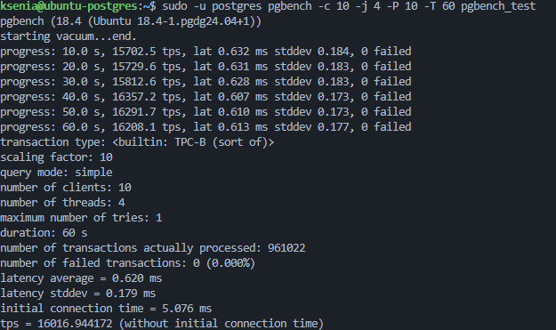
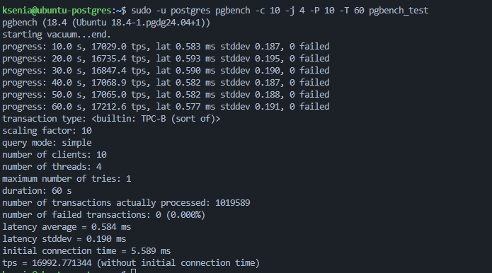
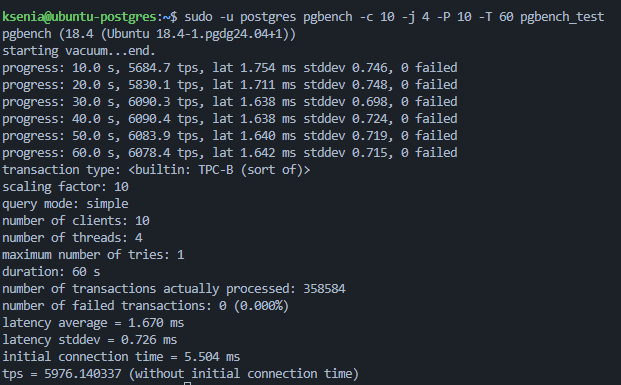
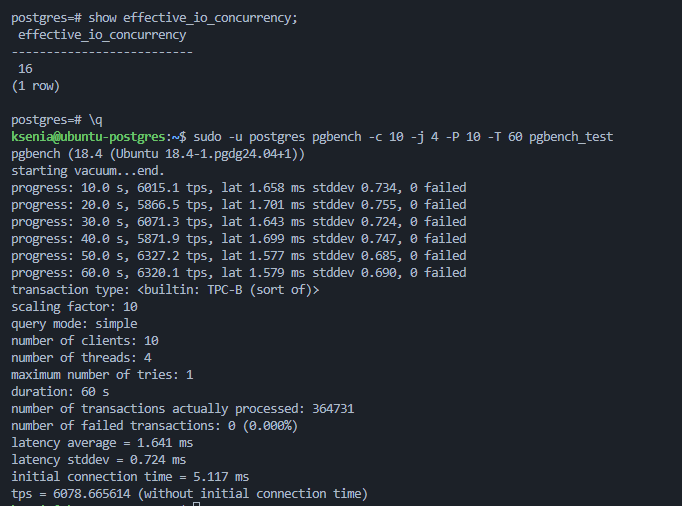

# 1. Используйте существующую ВМ/стенд с PostgreSQL;

Для работы использую существующую виртуальную машину с Ubuntu и PostgreSQL.

Проверю характеристики ВМ и установленные кластеры:

```bash
lscpu | grep -E '^CPU\(s\)|Model name'
free -h
lsblk
pg_lsclusters
```



На ВМ установлены PostgreSQL 16 и PostgreSQL 18. Для выполнения дз работы буду использовать PostgreSQL 18.

Остановлю кластер PostgreSQL 16:

```bash
sudo pg_ctlcluster 16 main stop
```

Для PostgreSQL 18 изменю порт на стандартный `5432` и перезапущу кластер:

```bash
sudo pg_ctlcluster 18 main restart
```

Проверю результат:

```bash
pg_lsclusters
```


# 2. Подготовьте pgbench: инициализируйте тестовую базу (scale выбрать 10);

Создам тестовую базу:

```bash
sudo -u postgres createdb pgbench_test
```

Инициализирую `pgbench` с `scale = 10`:

```bash
sudo -u postgres pgbench -i -s 10 pgbench_test
```

Проверю созданные таблицы и количество записей:

```sql
\dt

select count(*) from pgbench_accounts;
```

При `scale = 10` таблица `pgbench_accounts` содержит 1 000 000 записей:



# 3. Выполните baseline-прогон pgbench с фиксированными настройками (например, 60 секунд, 10 клиентов, 4 потока); / 4. Зафиксируйте tps baseline и условия теста (scale, время, клиенты/потоки);

Выполню baseline-прогон:

```bash
sudo -u postgres pgbench -c 10 -j 4 -P 10 -T 60 pgbench_test
```

По результатам теста:

- scale: 10;
- clients: 10;
- threads: 4;
- duration: 60 s;
- latency average: 1.675 ms;
- TPS: **5955.34**;
- failed transactions: 0.



# 5. Измените параметры PostgreSQL для получения максимальной производительности; / 6. Перезапустите кластер (если требуется) и повторите pgbench с теми же настройками; / 7. Сравните tps до/после и сделайте вывод, какие изменения дали эффект;

Для подбора параметров сначала использую рекомендации PGTune для конфигурации моей ВМ:

- PostgreSQL 18;
- Linux;
- тип нагрузки — OLTP;
- RAM — 7 GB;
- CPU — 10;
- тип диска — HDD



После применения рекомендаций перезапущу кластер и повторю тест с теми же условиями:

```bash
sudo pg_ctlcluster 18 main restart

sudo -u postgres pgbench -c 10 -j 4 -P 10 -T 60 pgbench_test
```

Полученный результат:

**TPS = 5981.93**

По сравнению с baseline (`5955.34 TPS`) автоматическая настройка практически не повлияла на производительность.


### Настройка shared_buffers

Далее вручную проверю влияние `shared_buffers`. Параметр определяет объём общей памяти PostgreSQL, используемой для кэширования страниц данных.

Сначала установлю:

```sql
alter system set shared_buffers = '2560MB';
```

После перезапуска кластера получен результат:

**TPS = 6087.35**



Затем увеличу значение до:

```sql
alter system set shared_buffers = '2800MB';
```

Результат:

**TPS = 5822.80**



Дальнейшее увеличение `shared_buffers` не дало прироста, поэтому оставлю значение `2560MB`.

### Настройка synchronous_commit

Проверю влияние ожидания синхронной записи WAL при завершении транзакции:

```sql
alter system set synchronous_commit = 'off';
select pg_reload_conf();
```

После изменения:

**TPS = 16016.94**

Производительность выросла значительно, так как транзакции больше не ожидают синхронной фиксации WAL перед возвратом результата клиенту.

При этом такая настройка снижает надёжность: при аварийном завершении работы возможна потеря последних подтверждённых транзакций. Поэтому после эксперимента параметр возвращён в `on`.



### Настройка fsync

Дополнительно проверю влияние `fsync`. Для эксперимента установлю:

```text
fsync = off
```

При одновременно отключённом `synchronous_commit` получен максимальный результат:

**TPS = 16992.77**

Отключение `fsync` увеличивает производительность, но снижает надёжность хранения данных и при сбое может привести к повреждению БД. Поэтому данный вариант использовался только для эксперимента, после чего `fsync` и `synchronous_commit` были возвращены в `on`.



### Настройка WAL и checkpoint

Далее проверю параметры WAL и checkpoint:

```sql
alter system set wal_buffers = '64MB';
alter system set max_wal_size = '16GB';
alter system set checkpoint_timeout = '15min';
alter system set checkpoint_completion_target = '0.9';
```

После перезапуска результат составил:

**TPS = 5976.14**

Заметного прироста производительности не произошло. Для данного короткого теста изменение параметров WAL и checkpoint практически не повлияло на результат.



### Настройка effective_io_concurrency

Проверю влияние количества параллельных операций ввода-вывода:

```sql
alter system set effective_io_concurrency = '16';
select pg_reload_conf();
```

Результат:

**TPS = 6078.67**

Значительного изменения производительности не произошло.



### Настройка work_mem

Последним проверю увеличение памяти, доступной для отдельных операций выполнения запросов:

```sql
alter system set work_mem = '32MB';
select pg_reload_conf();
```

Результат:

**TPS = 6198.31**

Это лучший результат среди протестированных вариантов без отключения `fsync` и `synchronous_commit`.


# 8. Кратко обоснуйте изменение каких параметров больше всего влияет на повышение производительности;

Наибольшее влияние на производительность показал параметр `synchronous_commit`: при его отключении TPS вырос с **5955 до 16017**, так как транзакции перестали ожидать синхронной записи WAL.

Отключение `fsync` позволило увеличить TPS до **16993**, но такие настройки снижают надёжность БД, поэтому для рабочей системы их использовать не стоит.

Среди настроек без снижения надёжности лучший результат (**6198 TPS**) был получен после настройки памяти (`shared_buffers = 2560MB`, `work_mem = 32MB`). Изменение параметров WAL/checkpoint и `effective_io_concurrency` заметного прироста не показало.
