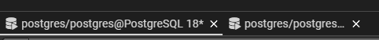
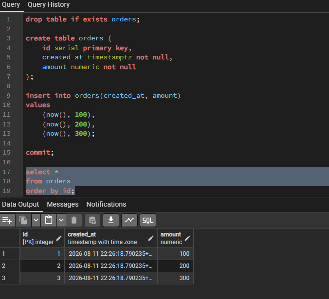
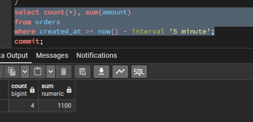
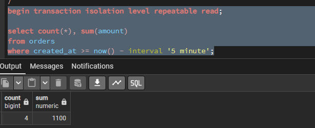
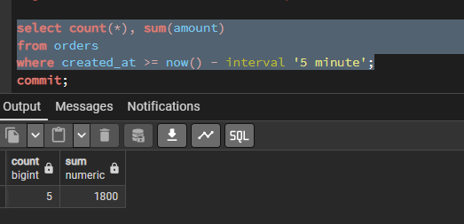

# 1. Откройте 2 сессии psql к PostgreSQL 17 и отключите autocommit;

Для выполнения работы использую PostgreSQL 18 и pgAdmin. Открываю две независимые сессии Query Tool для работы с транзакциями.

Проверяю, что используются разные соединения:

```sql
select pg_backend_pid();
```

Транзакциями управляю вручную с помощью `BEGIN`, `COMMIT` и `ROLLBACK`.



# 2. Создайте таблицу orders(id serial, created_at timestamptz, amount numeric) и вставьте 2–3 записи;

Создаю таблицу `orders` для хранения заказов:

```sql
create table orders (
    id serial primary key,
    created_at timestampz not null,
    amount numeric not null
);
```

Добавляю несколько тестовых записей и фиксирую изменения:

```sql
insert into orders(created_at, amount)
values
    (now(), 100),
    (now(), 200),
    (now(), 300);

commit;
```

Проверяю данные:

```sql
select *
from orders
order by id;
```

В таблице создано 3 записи с общей суммой `600`.



# 3. Read committed: в сессии 2 начните транзакцию и выполните select count(*), sum(amount) ... за последнюю минуту; в сессии 1 вставьте новый заказ и выполните commit; в сессии 2 повторите тот же select и зафиксируйте изменение; завершите транзакции;

Во второй сессии начинаю транзакцию с уровнем изоляции `READ COMMITTED`:

```sql
BEGIN TRANSACTION ISOLATION LEVEL READ COMMITTED;
SHOW transaction_isolation;
select count(*), sum(amount)
from orders
where created_at >= now() - interval '5 minute';
```

Первоначально получаю:

- количество заказов — `3`;
- сумма — `600`.

Не завершая транзакцию, в первой сессии добавляю новый заказ:

```sql
insert into orders(created_at, amount)
values (now(), 500);

commit;
```

После `COMMIT` в первой сессии повторяю тот же запрос во второй:

```sql
select count(*), sum(amount)
from orders
where created_at >= now() - interval '5 minute';
```

Теперь получаю:

- количество заказов — `4`;
- сумма — `1100`.

При `READ COMMITTED` каждый новый запрос внутри транзакции видит изменения, которые были зафиксированы другими транзакциями. Поэтому после `COMMIT` в первой сессии результат повторного запроса изменился.

Завершаю транзакцию:

```sql
commit;
```



# 4. Repeatable read: повторите сценарий, но обе транзакции начните с set transaction isolation level repeatable read;; сравните результаты внутри транзакции и после её завершения;

Повторяю предыдущий сценарий с уровнем изоляции `REPEATABLE READ`.

Во второй сессии начинаю транзакцию и выполняю запрос:

```sql
begin transaction isolation level repeatable read;

select count(*), sum(amount)
from orders
where created_at >= now() - interval '5 minute';
```


В первой сессии также начинаю транзакцию `REPEATABLE READ`, добавляю новый заказ и фиксирую изменения:

```sql
begin transaction isolation level repeatable read;

insert into orders(created_at, amount)
values (now(), 700);

commit;
```

Повторный `SELECT` во второй сессии показывает тот же результат, что и до вставки. Новая запись не видна, так как `REPEATABLE READ` использует один снимок данных на протяжении транзакции.

![]](images/04_repeatable_read_2.png)

После завершения транзакции:

```sql
commit;
```

повторяю `SELECT`. Теперь новая запись становится видна.

Таким образом, в отличие от `READ COMMITTED`, при `REPEATABLE READ` результат повторного чтения внутри одной транзакции не изменяется.



# 5. В отчёте укажите, где и почему меняются значения, и какой уровень изоляции нужен для отчёта;

При уровне `READ COMMITTED` значения `count` и `sum` меняются после `COMMIT` в другой сессии, так как каждый новый запрос получает актуальный снимок уже зафиксированных данных.

При `REPEATABLE READ` значения внутри транзакции не меняются, даже если в другой сессии были добавлены и зафиксированы новые данные. Они становятся видны только после завершения текущей транзакции.

Для формирования отчёта, данные в котором должны оставаться согласованными на протяжении всей транзакции, лучше использовать `REPEATABLE READ`, так как все запросы будут работать с одним снимком данных.