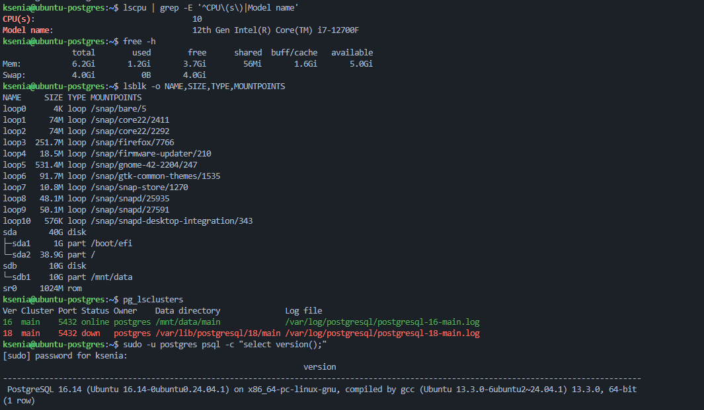
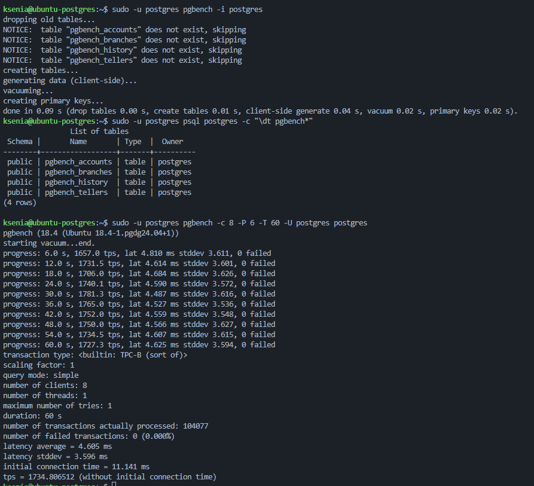
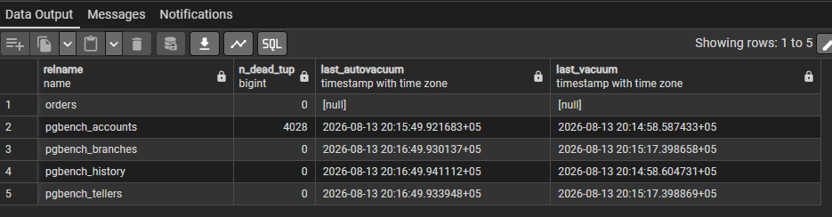
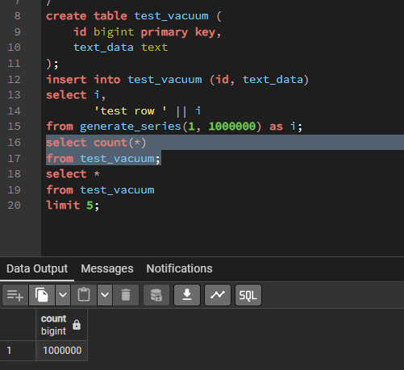
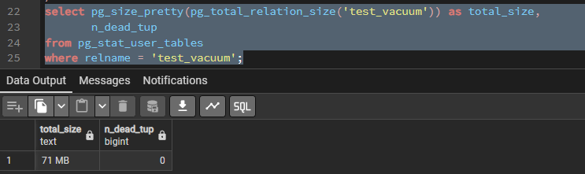
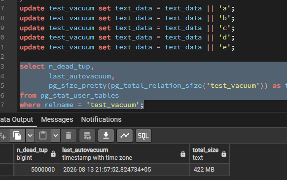
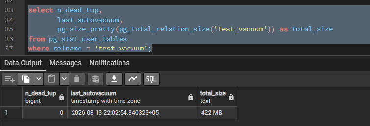
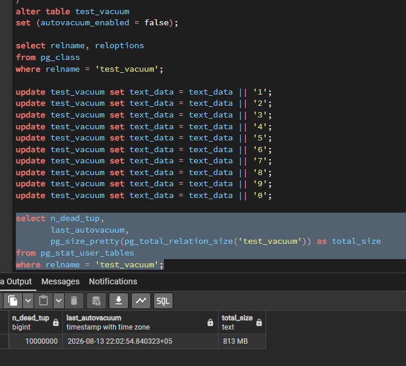
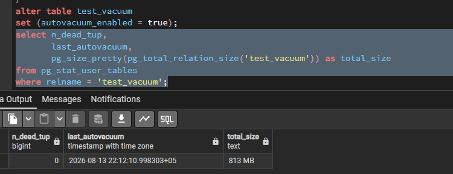

## 1. Создайте ВМ (2 vCPU, 4 GB RAM, SSD 10 GB) и установите PostgreSQL 17 с дефолтными настройками;

Для выполнения работы использую существующую ВМ с PostgreSQL 18.

Характеристики стенда:

- PostgreSQL — 18.4;
- CPU — 10;
- RAM — 6.2 GB;
- основной диск — 40 GB;
- дополнительный диск — 10 GB.

Проверяю характеристики ВМ:

```bash
lscpu | grep -E '^CPU\(s\)|Model name'
free -h
lsblk -o NAME,SIZE,TYPE,MOUNTPOINTS
```

Проверяю версию PostgreSQL:

```bash
sudo -u postgres psql -c "select version();"
```

В результате используется кластер PostgreSQL 18.4



## 2. Подготовьте тестовую базу pgbench (pgbench -i postgres) и выполните прогон нагрузки (pgbench -c8 -P 6 -T 60 -U postgres postgres);

Инициализирую `pgbench` в базе `postgres`:

```bash
sudo -u postgres pgbench -i postgres
```

Проверяю создание тестовых таблиц:

```bash
sudo -u postgres psql postgres -c "\dt pgbench*"
```

Запускаю нагрузку на 60 секунд с 8 клиентами:

```bash
sudo -u postgres pgbench -c 8 -P 6 -T 60 -U postgres postgres
```

По результатам теста обработано `104077` транзакций, ошибок нет, итоговый TPS — `1734.9`.



## 3. Подготовьте тестовую базу pgbench (pgbench -i postgres) и выполните прогон нагрузки (pgbench -c8 -P 6 -T 60 -U postgres postgres);

После выполнения нагрузки проверяю состояние пользовательских таблиц:

```sql
select relname,
       n_dead_tup,
       last_autovacuum,
       last_vacuum
from pg_stat_user_tables
order by relname;
```

После нагрузки для `pgbench_accounts` осталось `4028` мёртвых строк.  
Значение `last_autovacuum` заполнено, следовательно, autovacuum выполняется.



## 4. Создайте таблицу с текстовым полем и заполните её 1 000 000 строк (допускается генерация через generate_series);

Да, всё правильно: count = 1000000. Для отчёта коротко:

## 4. Создание тестовой таблицы

Создаю таблицу с текстовым полем:

```sql
create table test_vacuum (
    id bigint primary key,
    text_data text
);
```

Заполняю таблицу 1 000 000 строк с помощью `generate_series`:

```sql
insert into test_vacuum (id, text_data)
select i,
       'test row ' || i
from generate_series(1, 1000000) as i;
```

Проверяю количество записей:

```sql
select count(*)
from test_vacuum;
```



## 5. Зафиксируйте размер таблицы (например, pg_total_relation_size) и значение n_dead_tup;

Фиксирую размер таблицы и количество мёртвых строк:

```sql
select pg_size_pretty(pg_total_relation_size('test_vacuum')) as total_size,
       n_dead_tup
from pg_stat_user_tables
where relname = 'test_vacuum';
```

До выполнения обновлений размер таблицы составляет `71 MB`, количество мёртвых строк (`n_dead_tup`) — `0`.



## 6. Выполните 5 полных обновлений строк (добавление символа к текстовому полю), затем зафиксируйте n_dead_tup, last_autovacuum и размер таблицы;

Выполняю 5 полных обновлений таблицы, каждый раз добавляя символ к текстовому полю:

```sql
update test_vacuum set text_data = text_data || 'a';
update test_vacuum set text_data = text_data || 'b';
update test_vacuum set text_data = text_data || 'c';
update test_vacuum set text_data = text_data || 'd';
update test_vacuum set text_data = text_data || 'e';
```

После обновлений проверяю состояние таблицы:

```sql
select n_dead_tup,
       last_autovacuum,
       pg_size_pretty(pg_total_relation_size('test_vacuum')) as total_size
from pg_stat_user_tables
where relname = 'test_vacuum';
```

После 5 обновлений `n_dead_tup` увеличился до `5 000 000`, а размер таблицы вырос с `71 MB` до `422 MB`.



## 7. Дождитесь срабатывания autovacuum (периодически проверяя last_autovacuum) и зафиксируйте изменения n_dead_tup/размера;

Проверяю состояние таблицы:

```sql
select n_dead_tup,
       last_autovacuum,
       pg_size_pretty(pg_total_relation_size('test_vacuum')) as total_size
from pg_stat_user_tables
where relname = 'test_vacuum';
```

После срабатывания autovacuum количество мёртвых строк уменьшилось с `5 000 000` до `0`, при этом размер таблицы остался `422 MB`.

Autovacuum освобождает место внутри таблицы для повторного использования, но не уменьшает физический размер файла таблицы.



## 8. Отключите autovacuum только для этой таблицы, выполните 10 полных обновлений строк и снова зафиксируйте n_dead_tup и размер;

Отключаю autovacuum только для тестовой таблицы:

```sql
alter table test_vacuum
set (autovacuum_enabled = false);
```

После этого выполняю 10 полных обновлений строк и повторно проверяю состояние таблицы:

```sql
select n_dead_tup,
       last_autovacuum,
       pg_size_pretty(pg_total_relation_size('test_vacuum')) as total_size
from pg_stat_user_tables
where relname = 'test_vacuum';
```

После 10 обновлений количество мёртвых строк выросло до `10 000 000`, а размер таблицы — до `813 MB`



## 9. Объясните наблюдения: почему растёт размер и/или число «мёртвых» строк при отключённом обслуживании;

При `UPDATE` PostgreSQL создаёт новую версию строки, а старая становится «мёртвой». При отключённом autovacuum эти версии не очищаются и продолжают занимать место.

Поэтому после массовых обновлений увеличивается `n_dead_tup` и растёт размер таблицы.

## 10. Включите autovacuum обратно для таблицы;

После завершения эксперимента включаю autovacuum обратно:

```sql
alter table test_vacuum
set (autovacuum_enabled = true);
```

Проверяю его срабатывание:

```sql
select n_dead_tup,
       last_autovacuum,
       pg_size_pretty(pg_total_relation_size('test_vacuum')) as total_size
from pg_stat_user_tables
where relname = 'test_vacuum';
```

После срабатывания autovacuum количество мёртвых строк уменьшается.

