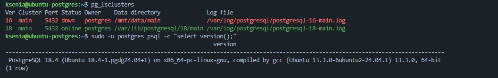
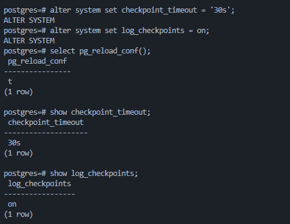
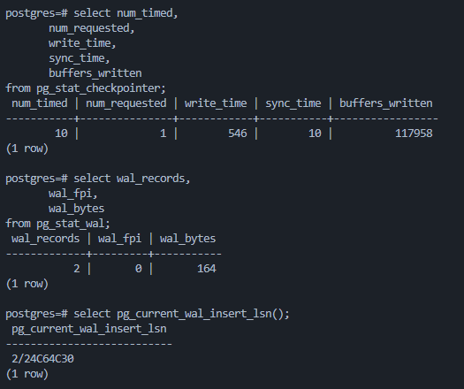
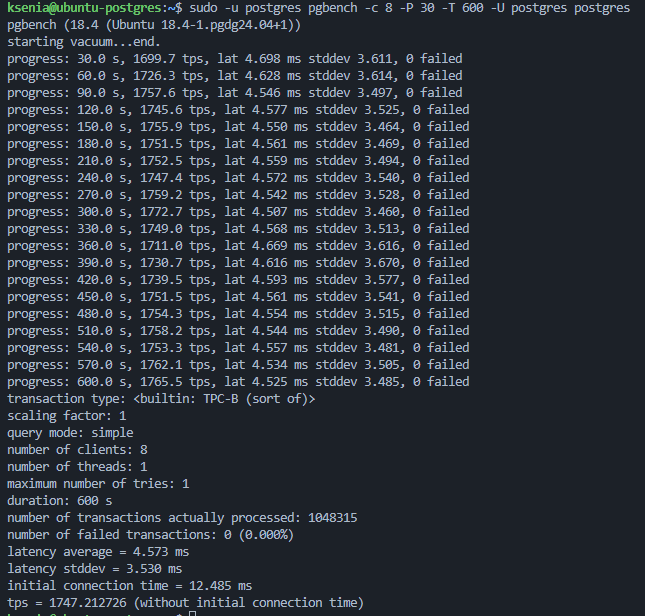
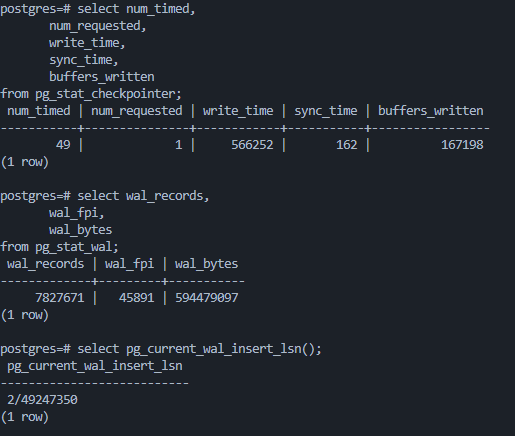
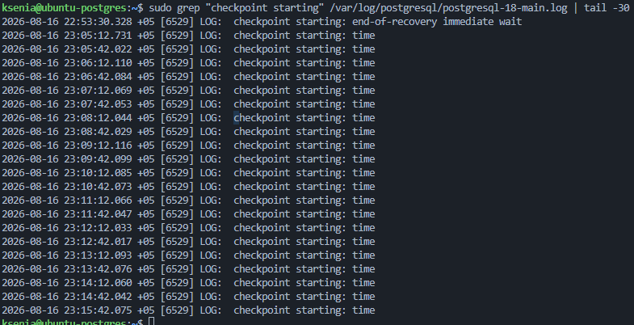
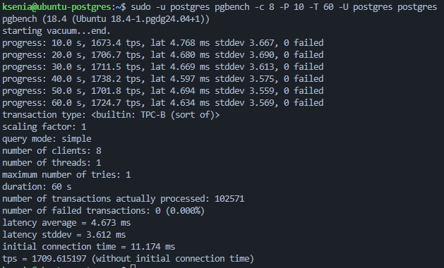
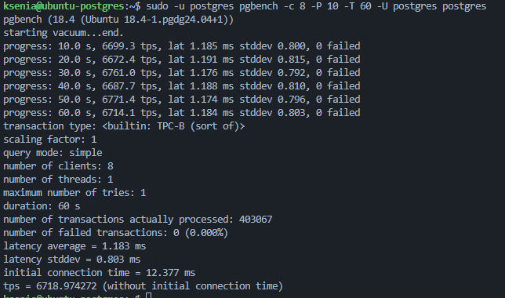

## 1. Используйте стенд с PostgreSQL 17 (допускается ВМ из предыдущих ДЗ) и установите pgbench;
Использую существующую ВМ с PostgreSQL 18.4.

```bash
pg_lsclusters
sudo -u postgres psql -c "select version();"
```

Кластер PostgreSQL 18 запущен на порту `5432`



## 2. Настройте выполнение контрольной точки раз в 30 секунд (параметр времени) и включите логирование контрольных точек;

Устанавливаю выполнение контрольной точки каждые 30 секунд и включаю логирование:

```sql
alter system set checkpoint_timeout = '30s';
alter system set log_checkpoints = on;

select pg_reload_conf();
```

Проверяю параметры:

```sql
show checkpoint_timeout;
show log_checkpoints;
```

Получено: `checkpoint_timeout = 30s`, `log_checkpoints = on`



## 3. Зафиксируйте начальные значения статистики контрольных точек и WAL (снимок «до»);

Перед запуском нагрузки фиксирую начальные значения:

```sql
select num_timed,
       num_requested,
       write_time,
       sync_time,
       buffers_written
from pg_stat_checkpointer;

select wal_records,
       wal_fpi,
       wal_bytes
from pg_stat_wal;

select pg_current_wal_insert_lsn();
```

Начальные значения:

- `num_timed = 10`;
- `num_requested = 1`;
- `wal_bytes = 164`;
- текущий LSN — `2/24C64C30`.

Эти значения используются как снимок «до»



## 4. Запустите нагрузку pgbench на 10 минут и зафиксируйте TPS;

Запускаю `pgbench` на 10 минут с 8 клиентами:

```bash
sudo -u postgres pgbench -c 8 -P 30 -T 600 -U postgres postgres
```

За время теста обработано `1 048 315` транзакций без ошибок. Итоговый TPS — `1747.21`



## 5. Зафиксируйте конечные значения статистики контрольных точек и WAL (снимок «после»);

После завершения нагрузки фиксирую конечные значения:

```sql
select num_timed,
       num_requested,
       write_time,
       sync_time,
       buffers_written
from pg_stat_checkpointer;

select wal_records,
       wal_fpi,
       wal_bytes
from pg_stat_wal;

select pg_current_wal_insert_lsn();
```

Получено:

- `num_timed = 49`;
- `num_requested = 1`;
- `wal_bytes = 594479097`;
- текущий LSN — `2/49247350`



## 6. Рассчитайте объём WAL за 10 минут и средний объём WAL на одну контрольную точку;

За 10 минут нагрузки:

```text
WAL = 594479097 - 164 = 594478933 байт ≈ 566,94 MB
```

Количество контрольных точек:

```text
49 - 10 = 39
```

Средний объём WAL на одну контрольную точку:

```text
594478933 / 39 ≈ 15,24 MB
```

За 10 минут было сгенерировано около `566,94 MB` WAL и выполнено `39` контрольных точек.

## 7. Проверьте по статистике/логам, выполнялись ли контрольные точки строго по расписанию, и объясните отклонения;

Проверяю запуск контрольных точек по логам:

```bash
sudo grep "checkpoint starting" /var/log/postgresql/postgresql-18-main.log | tail -30
```

Контрольные точки с причиной `time` выполнялись примерно каждые 30 секунд, что соответствует `checkpoint_timeout = 30s`.

Небольшие отклонения в пределах миллисекунд связаны с планированием фоновых процессов и текущей нагрузкой системы



## 8. Сравните TPS при синхронном и асинхронном подтверждении коммита (2 прогона pgbench в сопоставимых условиях) и объясните разницу;

Выполняю два одинаковых прогона `pgbench`:

```bash
sudo -u postgres pgbench -c 8 -P 10 -T 60 -U postgres postgres
```

Получены результаты:

| synchronous_commit | TPS | Средняя latency |
|---|---:|---:|
| `on` | 1709.62 | 4.673 ms |
| `off` | 6718.97 | 1.188 ms |




При `synchronous_commit = off` TPS увеличился примерно в 3,9 раза, поскольку транзакция не ожидает физической записи WAL на диск перед подтверждением `COMMIT`.

Асинхронный режим повышает производительность, но при аварийном завершении возможна потеря последних подтверждённых транзакций. Для финансовых операций предпочтителен `synchronous_commit = on`.