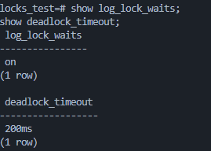
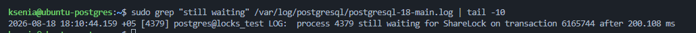
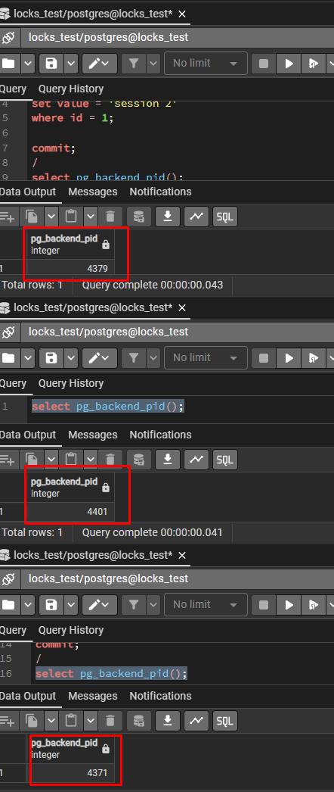
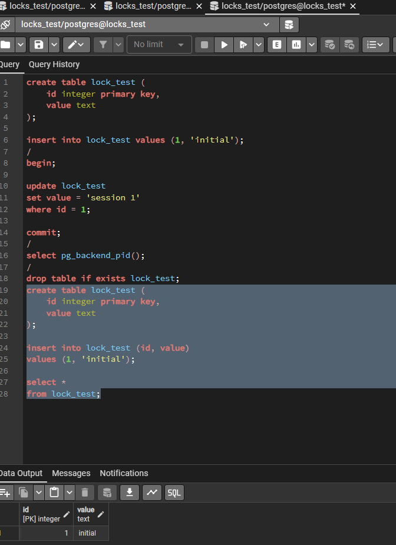
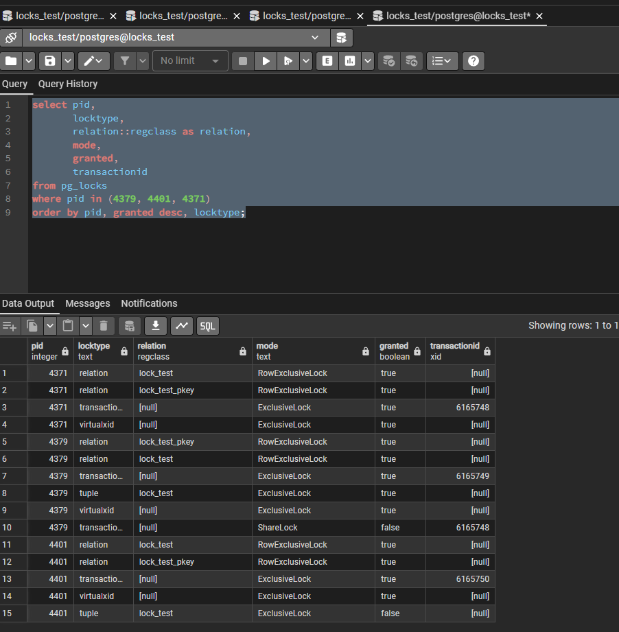
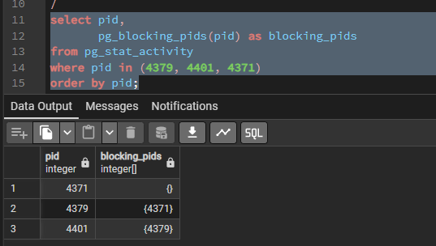
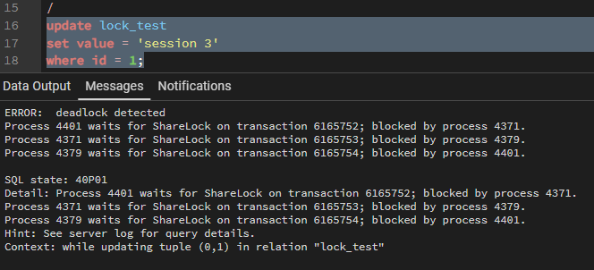
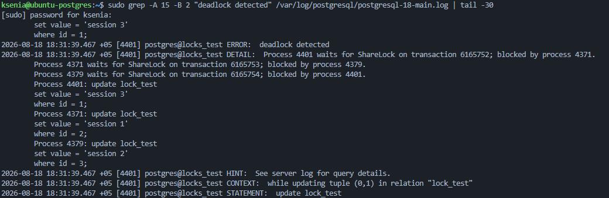

## 1. Настройте PostgreSQL так, чтобы в журнал сообщений записывались ожидания блокировок дольше 200 мс;

Исходные значения:

```sql
show log_lock_waits;
show deadlock_timeout;
```

- `log_lock_waits = off`
- `deadlock_timeout = 1s`

Настраиваю логирование ожиданий блокировок дольше 200 мс:

```sql
alter system set log_lock_waits = on;
alter system set deadlock_timeout = '200ms';

select pg_reload_conf();
```

После изменения: `log_lock_waits = on`, `deadlock_timeout = 200ms`



## 2. Воспроизведите ожидание блокировки дольше 200 мс и подтвердите это записью в журнале сообщений;

Создаю тестовую таблицу и добавляю одну строку:

```sql
create table lock_test (
    id integer primary key,
    value text
);

insert into lock_test values (1, 'initial');
```

В первой сессии начинаю транзакцию и обновляю строку, не выполняя `COMMIT`:

```sql
begin;

update lock_test
set value = 'session 1'
where id = 1;
```

Во второй сессии пытаюсь обновить ту же строку:

```sql
begin;

update lock_test
set value = 'session 2'
where id = 1;
```

Вторая сессия переходит в ожидание, так как строка заблокирована первой транзакцией.

Проверяю журнал PostgreSQL:

```bash
sudo grep "still waiting" /var/log/postgresql/postgresql-18-main.log | tail -10
```

В журнале зафиксировано ожидание дольше 200 мс:

```text
process 4379 still waiting for ShareLock on transaction 6165744 after 200.108 ms
```



## 3. Откройте три сессии psql к одной базе данных;

Открываю 3 сессии `psql` к базе `locks_test`.

В каждой сессии проверяю идентификатор процесса:

```sql
select pg_backend_pid();
```



## 4. Создайте тестовую таблицу и добавьте одну строку, которую будут обновлять все сессии;

В первой сессии создаю тестовую таблицу и добавляю одну строку:

```sql
drop table if exists lock_test;
create table lock_test (
    id integer primary key,
    value text
);

insert into lock_test (id, value)
values (1, 'initial');
```

Все три сессии подключены к одной базе `locks_test` и будут обновлять строку с `id = 1`



## 5. Выполните в трёх сессиях команды UPDATE, обновляющие одну и ту же строку, так чтобы одна транзакция удерживала блокировку, а остальные ожидали / 6. Во время ожидания снимите список блокировок из представления pg_locks и сохраните его для отчёта;

В трёх сессиях начинаю транзакции и выполняю `UPDATE` одной строки.

Первая сессия:

```sql
begin;

update lock_test
set value = 'session 1'
where id = 1;
```

Транзакцию не завершаю, поэтому она продолжает удерживать блокировку.

Во второй и третьей сессиях выполняю аналогичные `UPDATE`. Обе сессии переходят в ожидание освобождения ресурса.

## 6. Анализ блокировок

Во время ожидания проверяю блокировки:

```sql
select pid,
       locktype,
       relation::regclass as relation,
       mode,
       granted,
       transactionid
from pg_locks
where pid in (4379, 4401, 4371)
order by pid, granted desc, locktype;
```



Дополнительно проверяю цепочку блокирующих процессов:

```sql
select pid,
       pg_blocking_pids(pid) as blocking_pids
from pg_stat_activity
where pid in (4379, 4401, 4371)
order by pid;
```



Получена цепочка ожидания:

```text
4371 → удерживает ресурс
4379 → ожидает 4371
4401 → ожидает 4379
```

## 7. Объясните смысл каждой блокировки из pg_locks (что блокируется, какой режим, кто держит, кто ожидает);

- **PID 4371** — удерживает блокировку строки и ничего не ожидает
- **PID 4379** — ожидает завершения транзакции PID 4371 (`ShareLock`, `granted = false`)
- **PID 4401** — ожидает освобождения строки (`ExclusiveLock`, `granted = false`)
- `RowExclusiveLock` — блокировка таблицы при выполнении `UPDATE`

Цепочка ожидания:

```text
4371 → 4379 → 4401
```

`granted = true` — блокировка получена, `false` — ожидается

## 8. Воспроизведите взаимоблокировку трех транзакций. Можно ли разобраться в ситуации постфактум, изучая журнал сообщений?

Три транзакции обновляют разные строки, после чего каждая пытается изменить строку, заблокированную другой транзакцией:

```text
4401 → ждёт 4371
4371 → ждёт 4379
4379 → ждёт 4401
```

PostgreSQL обнаружил deadlock:

```text
ERROR: deadlock detected
SQL state: 40P01
```



Журнал:

```bash
sudo grep -A 15 -B 2 "deadlock detected" /var/log/postgresql/postgresql-18-main.log
```



В журнале указаны PID процессов, цепочка ожидания и выполняемые `UPDATE` поэтому причину взаимоблокировки можно определить постфактум

## 9. Могут ли две транзакции, выполняющие единственную команду UPDATE одной и той же таблицы (без where), заблокировать друг друга?

2 транзакции каждая из которых выполняет одну команду `UPDATE` одной таблицы без `WHERE`, не создадут взаимоблокировку

Одна транзакция получит блокировки, а вторая при конфликте будет ожидать её завершения, deadlock не возникает