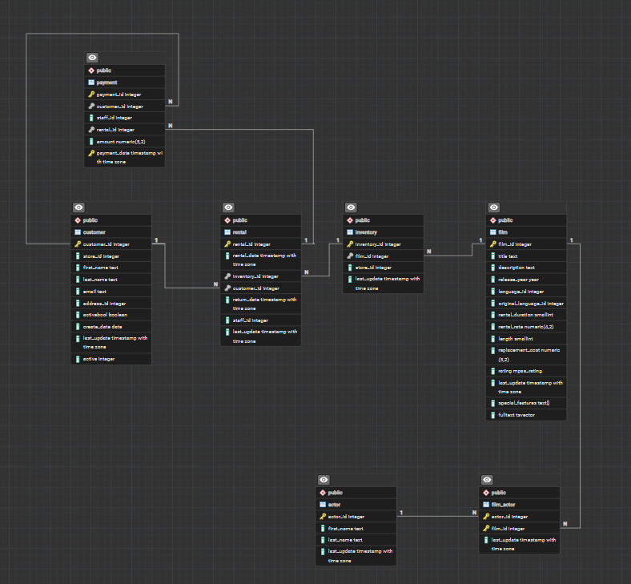
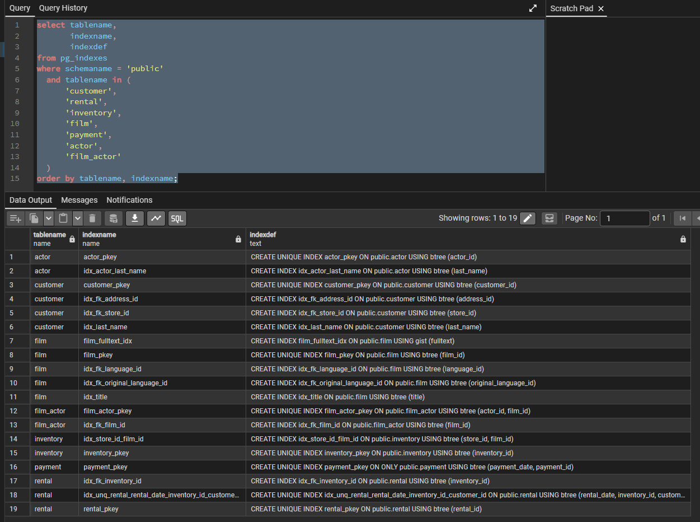
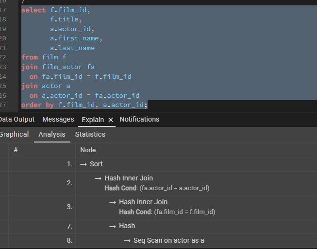
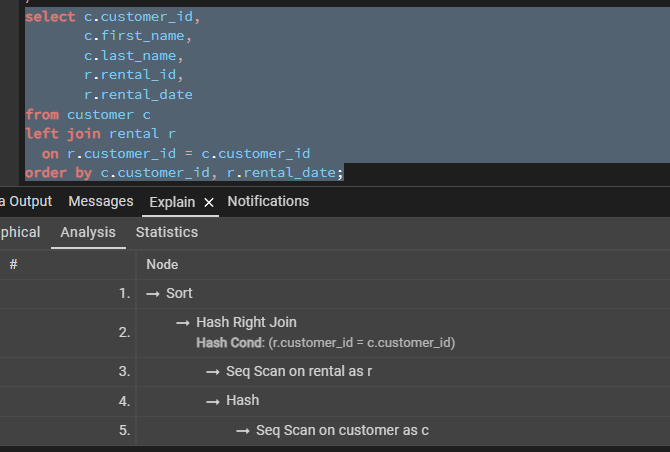
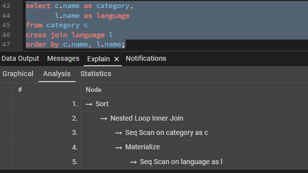
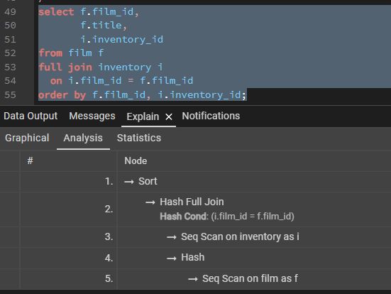
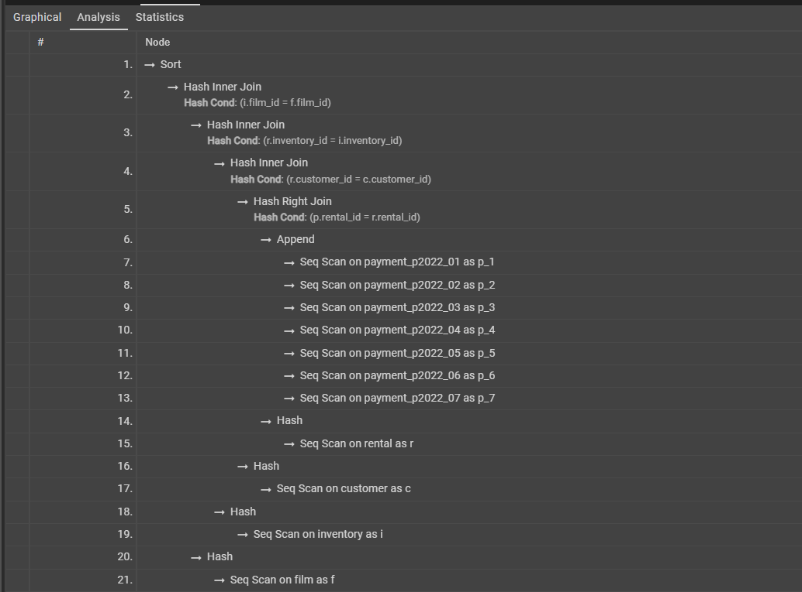

## Подготовка тестовой базы данных

Для выполнения работы используется готовая учебная база данных **Pagila** — PostgreSQL-версия демонстрационной базы Sakila. База загружена из открытого [репозитория Pagila на GitHub](https://github.com/devrimgunduz/pagila) (версия 3.1.0).

В работе используются таблицы:

- `customer` — клиенты;
- `rental` — аренды;
- `inventory` — экземпляры фильмов;
- `film` — фильмы;
- `payment` — платежи;
- `actor` — актёры;
- `film_actor` — связь фильмов и актёров.

Основные связи между таблицами представлены на диаграмме.



### Существующие индексы

Перед выполнением запросов проверяю индексы используемых таблиц:

```sql
select tablename,
       indexname,
       indexdef
from pg_indexes
where schemaname = 'public'
  and tablename in (
      'customer',
      'rental',
      'inventory',
      'film',
      'payment',
      'actor',
      'film_actor'
  )
order by tablename, indexname;
```

В исходной базе уже присутствуют индексы по первичным и внешним ключам, а также доп индексы



## 1. Реализовать прямое соединение двух или более таблиц

Выполняю прямое соединение таблиц `film`, `film_actor` и `actor` для получения списка фильмов и участвующих в них актёров:

```sql
select f.film_id,
       f.title,
       a.actor_id,
       a.first_name,
       a.last_name
from film f
join film_actor fa
  on fa.film_id = f.film_id
join actor a
  on a.actor_id = fa.actor_id
order by f.film_id, a.actor_id;
```

Для анализа запроса использую `EXPLAIN ANALYZE`.

PostgreSQL выполняет соединения с помощью `Hash Inner Join`. Для таблиц выбран `Seq Scan`, поскольку запрос обрабатывает практически все строки и использование индексов в данном случае невыгодно. `Sort` выполняется для реализации `ORDER BY`.



## 2. Реализовать левостороннее (или правостороннее) соединение двух или более таблиц

Выполняю `LEFT JOIN` таблиц `customer` и `rental`. В результат попадают все клиенты, включая клиентов без аренд.

```sql
select c.customer_id,
       c.first_name,
       c.last_name,
       r.rental_id,
       r.rental_date
from customer c
left join rental r
  on r.customer_id = c.customer_id
order by c.customer_id, r.rental_date;
```

В плане выполнения PostgreSQL преобразовал соединение в `Hash Right Join`. Таблицы читаются через `Seq Scan`, так как запрос обрабатывает практически все строки.



## 3. Реализовать кросс соединение двух или более таблиц

Выполняю `CROSS JOIN` таблиц `category` и `language` для получения всех возможных комбинаций категорий и языков:

```sql
select c.name as category,
       l.name as language
from category c
cross join language l
order by c.name, l.name;
```

Получено **96 строк**

В плане выполнения `CROSS JOIN` реализован через `Nested Loop` - каждая строка `category` соединяется с каждой строкой `language`. `Materialize` позволяет повторно использовать строки `language` из памяти.



## 4. Реализовать полное соединение двух или более таблиц

Выполняю `FULL JOIN` таблиц `film` и `inventory`. Полное соединение возвращает как совпавшие строки, так и строки, для которых соответствие в другой таблице отсутствует.

```sql
select f.film_id,
       f.title,
       i.inventory_id
from film f
full join inventory i
  on i.film_id = f.film_id
order by f.film_id, i.inventory_id;
```

В плане выполнения используется `Hash Full Join`. Таблицы `film` и `inventory` читаются с помощью `Seq Scan`.



## 5. Реализовать запрос, в котором будут использованы разные типы соединений

В одном запросе использую `INNER JOIN` и `LEFT JOIN`:

```sql
select c.customer_id,
       c.first_name,
       c.last_name,
       r.rental_id,
       f.title,
       p.amount
from customer c
join rental r
  on r.customer_id = c.customer_id
join inventory i
  on i.inventory_id = r.inventory_id
join film f
  on f.film_id = i.film_id
left join payment p
  on p.rental_id = r.rental_id
order by c.customer_id, r.rental_id;
```

В плане выполнения для прямых соединений используется `Hash Inner Join`. `LEFT JOIN` с таблицей `payment` оптимизатор представил как `Hash Right Join`.

